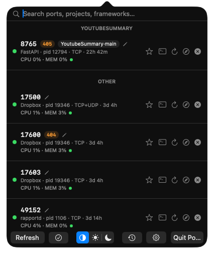

# Portly

A native macOS menu bar app for tracking local port usage — see what's listening on your machine, which project it belongs to, and kill it or open it in your browser with one click.

Showcase website: **[hellohopper.github.io/portly](https://hellohopper.github.io/portly/)**



## Features

| Feature | Description |
|---|---|
| Live port list | Every listening TCP/UDP port, refreshed every 2s, deduped across IPv4/IPv6 (and merged into one row when a process listens on both protocols for the same port) |
| Framework-aware labeling | Recognizes Vite, Next.js, Rails, Django, Flask, FastAPI, Node, Bun, Deno, and more from the process's command line |
| Git project context | Repo name + current branch, resolved from the process's working directory |
| CPU / memory + energy | Live %CPU and %MEM per process, plus a color-coded (green/yellow/red) Activity Monitor-style energy indicator |
| Uptime | How long each port has been listening |
| Kill process | One click, with a confirmation-free `SIGTERM` |
| Reveal owning terminal | Brings Terminal.app to the front and selects the exact tab running that process |
| Open / copy URL | Launch `localhost:<port>` in your browser, or right-click to copy the URL |
| Theme toggle | System / Light / Dark, persisted across launches |
| Active-port indicator | Green dot per row |

## Download

**Homebrew:**

```bash
brew tap hellohopper/portly
brew install --cask portly
```

**Manual:** grab the latest `Portly.dmg` from the [Releases page](https://github.com/hellohopper/portly/releases/latest), open it, and drag `Portly.app` into `Applications`.

Each release also publishes a `Portly.dmg.sha256` checksum (and includes the hash in the release notes) so you can verify the download:

```bash
shasum -a 256 -c Portly.dmg.sha256
```

> Releases are currently ad-hoc signed (not notarized — see [Packaging & Distribution](#packaging--distribution)), so on first launch macOS Gatekeeper will block it. Right-click `Portly.app` → **Open** → **Open** to bypass this once.

## Build from Source

### Requirements

- macOS 13+
- Xcode 15+ (or Command Line Tools) with the Swift 6 toolchain

### Steps

```bash
git clone https://github.com/hellohopper/portly.git
cd Portly

# Quick dev run (shows a Dock icon, fine for iterating)
swift run

# Build a proper .app bundle (no Dock icon, menu bar only)
./scripts/build-app.sh release
open .build/Portly.app
```

## Testing

```bash
swift test
```

Unit tests cover port parsing/dedup, uptime parsing/formatting, and git branch/worktree resolution. Requires the Swift Testing framework, which ships with Xcode 16+ (not available under bare Command Line Tools).

## Packaging & Distribution

```bash
# Build a drag-to-Applications DMG (ad-hoc signed)
./scripts/build-dmg.sh
```

For a signed + notarized build (requires a paid Apple Developer account):

```bash
export SIGN_IDENTITY="Developer ID Application: Your Name (TEAMID)"
export APPLE_ID="you@example.com"
export APPLE_TEAM_ID="TEAMID"
export APPLE_APP_SPECIFIC_PASSWORD="...."   # or use a stored notarytool profile
./scripts/notarize.sh
```

This signs with hardened runtime, submits to Apple's notary service, and staples the ticket to the DMG. Portly is intentionally unsandboxed (it shells out to `lsof`/`ps`/`kill` to inspect and manage other processes), so no App Sandbox entitlements are requested.

Pushing a `v*.*.*` tag triggers [`.github/workflows/release.yml`](.github/workflows/release.yml), which runs the test suite, builds the DMG, and publishes it to [Releases](https://github.com/hellohopper/portly/releases).

## License

[MIT](LICENSE)
